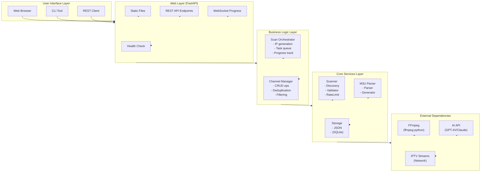
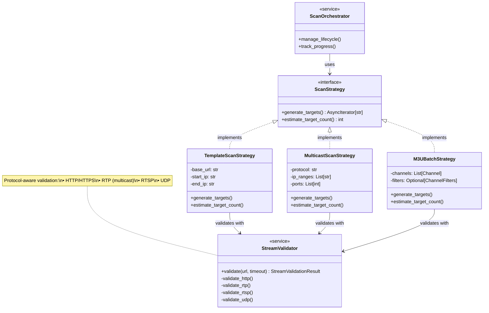
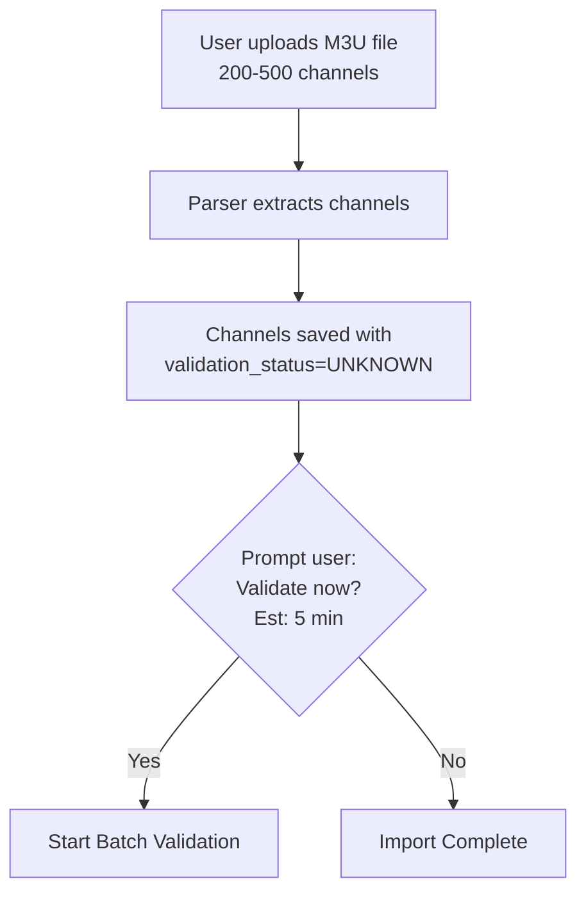

# IPTV Sniffer System Design

## Context and Scope

### Background

IPTV (Internet Protocol Television) streams are commonly available on local networks in home and small office environments. Users often need to discover, validate, and manage these streams, but lack user-friendly tools to do so. Existing solutions either require extensive technical knowledge (command-line FFmpeg) or are monolithic, poorly maintained applications.

This design document describes **iptv-sniffer**, a lightweight Python-based tool for discovering and validating IPTV channels on local networks. The tool provides M3U playlist import/export capabilities, stream validation via FFmpeg, and a web interface for user interaction.

**Key Use Cases:**

1. **HTTP Stream Discovery:** Scan local network HTTP servers for IPTV streams using URL templates
2. **Multicast Stream Discovery:** Discover RTP/UDP multicast streams
3. **M3U Validation:** Import external M3U playlists and batch-validate channel availability

### Reference Implementation

- Using `ffmpeg-python` library instead of subprocess command strings (type safety)
- Implementing proper async/await patterns for concurrent network operations
- Enforcing ethical network scanning with rate limiting
- Following modern Python best practices (Pydantic, mypy strict mode)
- Providing a clear migration path from JSON to SQLite storage

### Scope

**In Scope:**

- **Multiple Scanning Modes:**
  - HTTP-based IP range scanning with URL templates
  - RTP/UDP multicast address scanning with port lists
  - M3U batch validation for imported playlists
- **Multi-Protocol Support:** HTTP, HTTPS, RTP, RTSP, UDP, MMS
- FFmpeg-based stream validation with screenshot capture
- M3U/M3U8 playlist parsing and generation (extended attributes)
- Channel management (CRUD operations, grouping, metadata, validation status)
- Web interface (RESTful API + single-page frontend with mode selector)
- Scan preset system (e.g., "Beijing Unicom IPTV")
- Docker deployment with hardware acceleration support
- Ethical network scanning (rate limiting, private network enforcement)

**Out of Scope (Future Enhancements):**

- SSDP/UPnP automatic discovery (v1.1)
- EPG (Electronic Program Guide) integration
- Real-time stream monitoring and uptime tracking
- Multi-user support and authentication
- Mobile applications
- Stream transcoding
- Automatic channel name recognition (AI-based)

---

## Goals and Non-Goals

### Goals

1. **Ease of Use:** Non-technical users can discover and manage IPTV channels via web interface
2. **Flexible Scanning:** Support multiple scanning modes (HTTP template, multicast, M3U validation) through unified interface
3. **Multi-Protocol Support:** Validate HTTP, RTP, RTSP, UDP streams with protocol-specific optimizations
4. **Ethical Scanning:** Enforce rate limiting and private network restrictions to prevent network abuse
5. **Type Safety:** Use Pydantic models and mypy strict mode throughout to catch errors early
6. **Testability:** Modular architecture with clear separation of concerns enables comprehensive testing
7. **Production Ready:** Docker deployment with observability (metrics, logs, health checks)
8. **Maintainability:** Enforce 500-line module limit and follow conventional commits

### Non-Goals

1. **ACID Compliance:** JSON storage is sufficient for target use case (<1000 channels)
2. **Multi-Tenancy:** Tool targets single-user home network scenarios
3. **Real-Time Streaming:** Tool validates streams but doesn't provide playback functionality
4. **Public Network Scanning:** Explicitly forbidden; only private RFC1918 addresses allowed
5. **Zero Configuration:** Users must provide URL templates and IP ranges (no auto-discovery in v1)

---

## System Architecture

### High-Level Architecture



### Scanning Strategy Architecture

The system supports three scanning modes through a Strategy Pattern:



### Data Flow: Scan Operations

#### Mode 1: HTTP Template Scan

1. User submits: `base_url="http://192.168.2.2:7788/rtp/{ip}:8000"`, `start_ip="192.168.1.1"`, `end_ip="192.168.1.255"`
2. TemplateScanStrategy generates: `["http://192.168.2.2:7788/rtp/192.168.1.1:8000", ..., "http://192.168.2.2:7788/rtp/192.168.1.255:8000"]`
3. Validator validates each URL via FFmpeg (HTTP protocol)
4. Valid channels saved to database

#### Mode 2: Multicast Scan

1. User selects preset "Beijing Unicom IPTV" or custom config: `ip_ranges=["239.3.1.1-239.3.1.255"]`, `ports=[8000, 8004, ..., 8120]`
2. MulticastScanStrategy generates: `["rtp://239.3.1.1:8000", "rtp://239.3.1.1:8004", ..., "rtp://239.3.1.255:8120"]`
3. Smart port detection: Scan first IP with all ports, discover pattern, apply to remaining IPs
4. Validator validates RTP streams (longer timeout, multicast-specific FFmpeg options)
5. Valid channels saved to database

#### Mode 3: M3U Batch Validation

1. User imports M3U file → Channels created with `validation_status=UNKNOWN`
2. User triggers batch validation (optional filters: group, status)
3. M3UBatchStrategy generates list of channel URLs
4. Validator validates each URL (protocol-aware: HTTP, RTP, RTSP, etc.)
5. Channel records updated: `is_online`, `last_validated`, `validation_status`
6. Progress pushed via WebSocket

---

## Detailed Design

### 1. Web Framework Selection: FastAPI

**Decision:** Use FastAPI over Flask

**Rationale:**

- **Async Support:** Native async/await crucial for I/O-bound network scanning operations
- **Type Safety:** Automatic request/response validation via Pydantic (aligns with project requirements)
- **Performance:** ASGI-based server significantly faster for concurrent requests
- **API Documentation:** Automatic OpenAPI/Swagger generation
- **Modern Patterns:** Background tasks via `BackgroundTasks`, dependency injection

**Trade-offs:**

- ❌ More complex than Flask (learning curve, boilerplate)
- ❌ Reference implementation uses Flask (deviation)
- ✅ Better long-term maintainability (type safety catches bugs)
- ✅ Required async patterns for ethical network scanning

**Integration with Blocking FFmpeg:**

FFmpeg operations via `ffmpeg-python` are blocking. We use `asyncio.run_in_executor()` with `ThreadPoolExecutor` to integrate with async architecture:

```python
async def validate_stream(url: str) -> StreamValidationResult:
    loop = asyncio.get_running_loop()
    with ThreadPoolExecutor(max_workers=10) as executor:
        result = await loop.run_in_executor(
            executor,
            _sync_validate_stream,  # Blocking ffmpeg-python call
            url
        )
    return result
```

### 2. Storage Architecture: JSON with SQLite Migration Path

**Decision:** Start with JSON file storage, provide SQLite migration path

**Rationale:**

- **Simplicity:** Zero configuration, human-readable, easy backup
- **Sufficient Capacity:** Target use case is <1000 channels
- **Docker-Friendly:** File-based storage works well with Docker volumes
- **Migration Path:** Repository pattern abstracts storage, enabling future SQLite adoption

**Data Models (Pydantic):**

```python
class Channel(BaseModel):
    id: str = Field(default_factory=lambda: str(uuid.uuid4()))
    name: str
    url: HttpUrl
    tvg_id: Optional[str] = None
    tvg_logo: Optional[HttpUrl] = None
    group: Optional[str] = None
    resolution: Optional[str] = None  # "1920x1080", "3840x2160"
    is_online: bool = False
    last_validated: Optional[datetime] = None
    screenshot_path: Optional[str] = None
    created_at: datetime = Field(default_factory=datetime.utcnow)
    updated_at: datetime = Field(default_factory=datetime.utcnow)
```

**Repository Pattern:**

```python
class ChannelRepository(ABC):
    @abstractmethod
    async def add(self, channel: Channel) -> Channel:
        """Add new channel or update if exists (by URL)"""

    @abstractmethod
    async def find_all(self, filters: ChannelFilters) -> List[Channel]:
        """Find channels with filtering/sorting"""

    @abstractmethod
    async def delete(self, channel_id: str) -> bool:
        pass
```

Implementations: `JSONChannelRepository` (v1), `SQLiteChannelRepository` (future)

**Trade-offs:**

- ❌ JSON: No concurrent writes, inefficient queries, no transactions
- ❌ SQLite: More setup complexity, requires migrations
- ✅ JSON: Sufficient for MVP, aligns with reference implementation
- ✅ Repository: Easy to swap backends later

### 3. Network Discovery: HTTP Probing

**Decision:** Implement HTTP probing (IP range scanning), defer SSDP to v1.1

**Rationale:**

- **Proven Approach:** Reference implementation validates this works for most IPTV setups
- **User Control:** User specifies URL template and IP range (deterministic)
- **Simplicity:** No multicast handling, no UPnP library dependencies
- **Coverage:** Covers 95% of home IPTV scenarios

**URL Template System:**

User provides: `http://192.168.2.2:7788/rtp/{ip}:8000`
System generates: `http://192.168.2.2:7788/rtp/192.168.1.100:8000`

**IP Range Validation (Security):**

```python
def validate_private_network(start_ip: str, end_ip: str) -> bool:
    """Ensure IP range is within RFC1918 private networks"""
    private_ranges = [
        ipaddress.ip_network('10.0.0.0/8'),
        ipaddress.ip_network('172.16.0.0/12'),
        ipaddress.ip_network('192.168.0.0/16'),
    ]

    start = ipaddress.ip_address(start_ip)
    end = ipaddress.ip_address(end_ip)

    for network in private_ranges:
        if start in network and end in network:
            return True

    raise SecurityError("Only private IP ranges allowed")
```

**Maximum Range Limit:**

To prevent DoS-style behavior, limit maximum IP range to 1024 addresses per scan.

**Trade-offs:**

- ❌ No automatic discovery (user must know network setup)
- ❌ Slower than multicast announcement listening
- ✅ Works with non-UPnP IPTV services (majority)
- ✅ Simpler implementation and testing

### 4. Concurrency Control and Rate Limiting

**Decision:** Asyncio + Semaphore for rate limiting, ThreadPoolExecutor for FFmpeg

**Requirements:**

- Default concurrency: 10 simultaneous requests
- Maximum concurrency: 50 (configurable)
- Timeout: 10 seconds (default), 60 seconds (max)
- Retry: Maximum 3 attempts with exponential backoff
- Graceful shutdown on SIGINT/SIGTERM

**Implementation:**

```python
class RateLimiter:
    def __init__(self, max_concurrency: int = 10):
        self.semaphore = asyncio.Semaphore(max_concurrency)
        self.timeout = 10

    async def execute(self, coro):
        async with self.semaphore:
            try:
                return await asyncio.wait_for(coro, timeout=self.timeout)
            except asyncio.TimeoutError:
                logger.warning("Operation timed out", timeout=self.timeout)
                raise
```

**Producer-Consumer Pattern:**

- **Producer:** IP range generator (fast, generates IPs)
- **Consumer Pool:** Stream validators (slow, I/O bound)
- **Queue:** `asyncio.Queue` with `maxsize=max_concurrency`

This naturally limits concurrent operations and prevents memory exhaustion.

**Retry Logic:**

```python
async def validate_with_retry(url: str, max_retries: int = 3) -> Result:
    for attempt in range(max_retries):
        try:
            return await validate_stream(url)
        except NetworkError as e:
            if attempt == max_retries - 1:
                raise
            backoff = 1.5 ** attempt  # Exponential backoff
            await asyncio.sleep(backoff)
```

**Trade-offs:**

- ❌ Complexity from mixing async (networking) and sync (FFmpeg) code
- ✅ Respects network resources (ethical scanning)
- ✅ Configurable limits for different network conditions
- ✅ Prevents accidental DDoS-like behavior

### 5. FFmpeg Integration Strategy

**Decision:** Use `ffmpeg-python` library with type hints, never subprocess strings

**Requirements:**

- Stream connectivity probe
- Codec and resolution detection
- Screenshot capture
- Hardware acceleration support (VAAPI, CUDA)
- Timeout enforcement (default 10s)

**Stream Validation:**

```python
import ffmpeg

def validate_stream(url: str, timeout: int = 10) -> StreamValidationResult:
    try:
        # Probe stream metadata
        probe = ffmpeg.probe(url, timeout=timeout)

        video_stream = next(
            (s for s in probe['streams'] if s['codec_type'] == 'video'),
            None
        )

        if not video_stream:
            raise ValidationError("No video stream found")

        resolution = f"{video_stream['width']}x{video_stream['height']}"
        codec = video_stream['codec_name']

        return StreamValidationResult(
            url=url,
            is_valid=True,
            resolution=resolution,
            codec_video=codec,
            timestamp=datetime.utcnow()
        )
    except ffmpeg.Error as e:
        logger.error(
            "FFmpeg validation failed",
            url=url,
            stderr=e.stderr.decode() if e.stderr else None
        )
        raise
```

**Screenshot Capture:**

```python
def capture_screenshot(
    url: str,
    output_path: Path,
    timeout: int = 10,
    hwaccel: Optional[str] = None
) -> None:
    input_opts = {'t': 5, 'timeout': timeout}

    if hwaccel == 'vaapi':
        input_opts.update({
            'hwaccel': 'vaapi',
            'hwaccel_device': '/dev/dri/renderD128',
            'hwaccel_output_format': 'vaapi'
        })
    elif hwaccel == 'cuda':
        input_opts.update({
            'hwaccel': 'cuda',
            'hwaccel_output_format': 'cuda'
        })

    (
        ffmpeg
        .input(url, **input_opts)
        .output(
            str(output_path),
            vframes=1,
            format='image2',
            vcodec='png'
        )
        .overwrite_output()
        .run(capture_stdout=True, capture_stderr=True)
    )
```

**Trade-offs:**

- ❌ `ffmpeg-python` is blocking (requires thread pool integration)
- ❌ Less control than direct subprocess (but that's intentional)
- ✅ Type-safe, prevents command injection
- ✅ Cross-platform (abstracts platform differences)
- ✅ Satisfies project requirement (AGENTS.md)

### 6. M3U Format Handling

**Decision:** Support extended M3U attributes with character encoding detection

**M3U Format Example:**

```m3u
#EXTM3U
#EXTINF:-1 tvg-id="CCTV1" tvg-name="CCTV-1" tvg-logo="http://example.com/logo.png" group-title="央视",CCTV-1
http://192.168.1.100:8000
```

**Parser Implementation:**

```python
class M3UParser:
    def parse(self, content: str) -> M3UPlaylist:
        lines = content.splitlines()
        channels = []

        i = 0
        while i < len(lines):
            line = lines[i].strip()

            if line.startswith('#EXTINF'):
                # Parse extended attributes
                attrs = self._parse_extinf(line)
                i += 1

                # Next line should be URL
                if i < len(lines):
                    url = lines[i].strip()
                    channel = M3UChannel(
                        name=attrs['name'],
                        url=url,
                        tvg_id=attrs.get('tvg-id'),
                        tvg_logo=attrs.get('tvg-logo'),
                        group_title=attrs.get('group-title')
                    )
                    channels.append(channel)
            i += 1

        return M3UPlaylist(channels=channels)

    def _parse_extinf(self, line: str) -> dict:
        # Regex to extract attributes
        pattern = r'([a-z-]+)="([^"]*)"'
        attrs = dict(re.findall(pattern, line))

        # Extract channel name (after last comma)
        name = line.split(',')[-1].strip()
        attrs['name'] = name

        return attrs
```

**Character Encoding Handling:**

Many M3U files use non-UTF-8 encoding (e.g., GB2312 for Chinese channels):

```python
def read_m3u_file(path: Path) -> str:
    # Try UTF-8 first
    try:
        return path.read_text(encoding='utf-8')
    except UnicodeDecodeError:
        # Detect encoding using chardet
        raw = path.read_bytes()
        detected = chardet.detect(raw)
        encoding = detected['encoding']
        logger.info(f"Detected encoding: {encoding}")
        return raw.decode(encoding)
```

**Trade-offs:**

- ❌ M3U format has many unofficial extensions (handle gracefully)
- ❌ Character encoding detection adds dependency (chardet)
- ✅ Supports international channel names
- ✅ Compatible with popular IPTV players (VLC, Kodi)

### 7. Channel Deduplication Strategy

**Decision:** URL-based deduplication with merge strategy for metadata

**Problem:** Multiple sources (scans, imports, manual edits) can create duplicates

**Deduplication Rules:**

1. **Primary Key:** URL (normalized)
2. **Merge Strategy:**
   - Manual edits (name, logo, group) take precedence
   - Auto-detected fields (resolution, online status) are updated
   - Timestamps track last update

**Implementation:**

```python
class ChannelDeduplicator:
    async def merge_or_add(
        self,
        new_channel: Channel,
        repository: ChannelRepository
    ) -> Channel:
        existing = await repository.get_by_url(new_channel.url)

        if not existing:
            return await repository.add(new_channel)

        # Merge: manual fields from existing, auto fields from new
        merged = existing.copy(update={
            'resolution': new_channel.resolution,
            'is_online': new_channel.is_online,
            'last_validated': new_channel.last_validated,
            'screenshot_path': new_channel.screenshot_path,
            'updated_at': datetime.utcnow()
        })

        # Only update name/logo/group if not manually edited
        if not existing.manually_edited:
            merged.name = new_channel.name
            merged.tvg_logo = new_channel.tvg_logo
            merged.group = new_channel.group

        return await repository.update(merged)
```

**Trade-offs:**

- ❌ URL normalization complexity (query params, trailing slashes)
- ❌ "Manually edited" flag adds complexity
- ✅ Preserves user customizations
- ✅ Keeps data fresh from scans

### 8. REST API Design

**Endpoints:**

```text
# Scan Operations
POST   /api/scan/start           # Start IP range scan
GET    /api/scan/{scan_id}       # Get scan status
DELETE /api/scan/{scan_id}       # Cancel scan

# Channel Operations
GET    /api/channels              # List channels (with filters)
GET    /api/channels/{id}         # Get single channel
PUT    /api/channels/{id}         # Update channel
DELETE /api/channels/{id}         # Delete channel
POST   /api/channels/test         # Batch connectivity test

# M3U Operations
POST   /api/m3u/import            # Import M3U file
GET    /api/m3u/export            # Export M3U playlist

# Group Operations
GET    /api/groups                # List groups
POST   /api/groups                # Create group
PUT    /api/groups/{id}           # Update group
DELETE /api/groups/{id}           # Delete group

# System
GET    /health                    # Health check
GET    /metrics                   # Prometheus metrics
```

**Request/Response Models (Pydantic):**

```python
class ScanStartRequest(BaseModel):
    base_url: str = Field(..., regex=r'^https?://')
    start_ip: str = Field(..., regex=r'^\d{1,3}(\.\d{1,3}){3}$')
    end_ip: str = Field(..., regex=r'^\d{1,3}(\.\d{1,3}){3}$')
    timeout: int = Field(default=10, ge=1, le=60)

    @validator('start_ip', 'end_ip')
    def validate_private_network(cls, v):
        ip = ipaddress.ip_address(v)
        if not ip.is_private:
            raise ValueError('Only private IP addresses allowed')
        return v

class ScanStatusResponse(BaseModel):
    scan_id: str
    status: ScanStatus  # Enum: pending, running, completed, failed
    progress: int
    total: int
    results: List[ChannelDiscoveryResult]
    started_at: datetime
    completed_at: Optional[datetime] = None
```

**WebSocket for Real-Time Updates:**

```python
@app.websocket("/ws/scan/{scan_id}")
async def scan_progress_websocket(
    websocket: WebSocket,
    scan_id: str
):
    await websocket.accept()

    async for progress in scan_service.get_progress_stream(scan_id):
        await websocket.send_json(progress.dict())
```

**Trade-offs:**

- ❌ WebSocket adds complexity (connection management)
- ✅ Real-time progress updates improve UX significantly
- ✅ Pydantic validation prevents invalid requests
- ✅ OpenAPI documentation auto-generated

### 9. Docker Deployment

**Multi-Stage Dockerfile:**

```dockerfile
# Stage 1: Build Python dependencies
FROM python:3.11-slim AS builder
WORKDIR /build
COPY pyproject.toml uv.lock ./
RUN pip install uv && uv sync --frozen --no-dev

# Stage 2: Final image with FFmpeg
FROM python:3.11-slim

# Install FFmpeg and required libraries
RUN apt-get update && \
    apt-get install -y --no-install-recommends \
        ffmpeg \
        libavcodec-extra \
        curl \
    && rm -rf /var/lib/apt/lists/*

# Copy Python dependencies
COPY --from=builder /build/.venv /app/.venv

# Copy application code
COPY iptv_sniffer /app/iptv_sniffer

WORKDIR /app
ENV PATH="/app/.venv/bin:$PATH"
ENV PYTHONUNBUFFERED=1

# Create data directories
RUN mkdir -p /app/data /app/screenshots && \
    chown -R nobody:nogroup /app/data /app/screenshots

# Health check
HEALTHCHECK --interval=30s --timeout=10s --start-period=5s --retries=3 \
    CMD curl -f http://localhost:8000/health || exit 1

# Run as non-root
USER nobody

EXPOSE 8000

CMD ["uvicorn", "iptv_sniffer.web.app:app", "--host", "0.0.0.0", "--port", "8000"]
```

**Docker Compose with Hardware Acceleration:**

```yaml
version: "3.8"
services:
  iptv-sniffer:
    build: .
    container_name: iptv-sniffer
    ports:
      - "8000:8000"
    volumes:
      - ./data:/app/data
      - ./screenshots:/app/screenshots
    devices:
      - /dev/dri:/dev/dri # Intel Quick Sync (VAAPI)
    environment:
      - MAX_CONCURRENCY=10
      - TIMEOUT=10
      - LOG_LEVEL=INFO
      - FFMPEG_HWACCEL=vaapi
    restart: unless-stopped
```

**Image Size Optimization:**

- Base image: `python:3.11-slim` (~120MB)
- FFmpeg: ~200MB
- Application: ~30MB
- **Total:** ~350MB (well under 500MB requirement)

**Trade-offs:**

- ❌ Docker adds deployment complexity for beginners
- ❌ Hardware acceleration requires device passthrough (not all platforms)
- ✅ FFmpeg bundled (no user installation required)
- ✅ Reproducible builds and deployments
- ✅ Health check enables container orchestration

### 10. Configuration Management

**Configuration Sources (priority order):**

1. CLI arguments (highest priority)
2. Environment variables (`IPTV_SNIFFER_*`)
3. Config file (`config/config.json`)
4. Defaults (lowest priority)

**Configuration Model:**

```python
class AppConfig(BaseModel):
    # Network Scanning
    max_concurrency: int = Field(default=10, ge=1, le=50)
    timeout: int = Field(default=10, ge=1, le=60)
    retry_attempts: int = Field(default=3, ge=0, le=5)
    retry_backoff: float = Field(default=1.5, ge=1.0, le=3.0)

    # FFmpeg
    ffmpeg_timeout: int = Field(default=10, ge=1, le=60)
    ffmpeg_hwaccel: Optional[Literal['vaapi', 'cuda']] = None
    ffmpeg_custom_args: List[str] = Field(default_factory=list)

    # Storage
    data_dir: Path = Field(default=Path("./data"))
    screenshot_dir: Path = Field(default=Path("./screenshots"))

    # Web Server
    host: str = Field(default="0.0.0.0")
    port: int = Field(default=8000, ge=1, le=65535)

    # AI Integration
    ai_enabled: bool = Field(default=False)
    ai_api_url: Optional[HttpUrl] = None
    ai_api_key: Optional[SecretStr] = None

    # Logging
    log_level: Literal['DEBUG', 'INFO', 'WARNING', 'ERROR'] = 'INFO'
    log_format: Literal['json', 'text'] = 'json'

    class Config:
        env_prefix = "IPTV_SNIFFER_"
        env_file = ".env"
```

**Trade-offs:**

- ❌ Multiple config sources can cause confusion
- ✅ Flexible deployment (dev vs Docker vs CLI)
- ✅ Pydantic validation prevents invalid configs
- ✅ SecretStr prevents accidental API key logging

### 11. Flexible Scanning Strategies (Strategy Pattern)

**Decision:** Implement Strategy Pattern to support multiple scanning modes

**Rationale:**

Current design assumed single URL template + IP range scanning. Real-world requirements include:

- **Multicast streams:** RTP/UDP on fixed IP ranges with varying ports
- **M3U validation:** Batch-validate imported channels from external sources
- **Future extensibility:** SSDP discovery, custom protocols

**Implementation:**

```python
class ScanStrategy(ABC):
    """Abstract base for different scanning strategies"""

    @abstractmethod
    async def generate_targets(self) -> AsyncIterator[str]:
        """Generate stream URLs to validate"""
        pass

    @abstractmethod
    def estimate_target_count(self) -> int:
        """Estimate total targets for progress tracking"""
        pass

# Strategy 1: URL Template + IP Range (existing)
class TemplateScanStrategy(ScanStrategy):
    def __init__(self, base_url: str, start_ip: str, end_ip: str):
        self.base_url = base_url  # e.g., "http://192.168.2.2:7788/rtp/{ip}:8000"
        self.start_ip = start_ip
        self.end_ip = end_ip

    async def generate_targets(self) -> AsyncIterator[str]:
        for ip in self._generate_ip_range():
            yield self.base_url.replace('{ip}', ip)

# Strategy 2: Multicast Address + Port List (new)
class MulticastScanStrategy(ScanStrategy):
    def __init__(
        self,
        protocol: str,  # "rtp", "udp"
        ip_ranges: List[str],  # ["239.3.1.1-239.3.1.255"]
        ports: List[int]  # [8000, 8004, 8008, ...]
    ):
        self.protocol = protocol
        self.ip_ranges = ip_ranges
        self.ports = ports

    async def generate_targets(self) -> AsyncIterator[str]:
        for ip_range in self.ip_ranges:
            for ip in self._parse_ip_range(ip_range):
                for port in self.ports:
                    yield f"{self.protocol}://{ip}:{port}"

    def estimate_target_count(self) -> int:
        total_ips = sum(self._count_ips(r) for r in self.ip_ranges)
        return total_ips * len(self.ports)

# Strategy 3: M3U Batch Validation (new)
class M3UBatchStrategy(ScanStrategy):
    def __init__(self, channels: List[Channel], filters: Optional[ChannelFilters] = None):
        self.channels = self._apply_filters(channels, filters)

    async def generate_targets(self) -> AsyncIterator[str]:
        for channel in self.channels:
            yield str(channel.url)

    def estimate_target_count(self) -> int:
        return len(self.channels)
```

**API Changes:**

```python
class ScanMode(str, Enum):
    TEMPLATE = "template"
    MULTICAST = "multicast"
    M3U_BATCH = "m3u_batch"

class ScanStartRequest(BaseModel):
    mode: ScanMode

    # Template mode fields
    base_url: Optional[str] = None
    start_ip: Optional[str] = None
    end_ip: Optional[str] = None

    # Multicast mode fields
    protocol: Optional[str] = None
    ip_ranges: Optional[List[str]] = None
    ports: Optional[List[int]] = None
    preset: Optional[str] = None  # "beijing-unicom"

    # M3U batch mode fields
    filters: Optional[ChannelFilters] = None

    timeout: int = Field(default=10, ge=1, le=60)
```

**Trade-offs:**

- ❌ Increased complexity (3 strategies vs 1)
- ✅ Open/Closed Principle: Add new strategies without modifying existing code
- ✅ Unified interface: Same validation pipeline regardless of discovery method
- ✅ Future-proof: Easy to add SSDP, DLNA, custom protocols

### 12. Multi-Protocol Stream Validation

**Decision:** Support HTTP, RTP, RTSP, UDP protocols with protocol-specific validation

**Rationale:**

Real-world IPTV streams use diverse protocols:

- HTTP/HTTPS: Most common, easy to validate
- RTP (Real-time Transport Protocol): Multicast IPTV (e.g., ISP-provided)
- RTSP (Real Time Streaming Protocol): Camera streams, some IPTV
- UDP: Raw transport streams

**Implementation:**

```python
class StreamValidator:
    def __init__(self, executor: ThreadPoolExecutor):
        self.executor = executor
        self.validators = {
            'http': self._validate_http,
            'https': self._validate_http,
            'rtp': self._validate_rtp,
            'rtsp': self._validate_rtsp,
            'udp': self._validate_udp,
        }

    async def validate(self, url: str, timeout: int = 10) -> StreamValidationResult:
        protocol = self._detect_protocol(url)
        validator = self.validators.get(protocol)

        if not validator:
            return StreamValidationResult(
                url=url,
                is_valid=False,
                protocol=protocol,
                error_category=ErrorCategory.UNSUPPORTED_PROTOCOL
            )

        loop = asyncio.get_running_loop()
        return await loop.run_in_executor(
            self.executor,
            validator,
            url,
            timeout
        )

    def _validate_rtp(self, url: str, timeout: int = 20) -> StreamValidationResult:
        """RTP streams need longer timeout for multicast join + data reception"""
        try:
            probe = ffmpeg.probe(
                url,
                timeout=timeout,
                rtbufsize='100M',  # Increase buffer for multicast
                analyzeduration='10M',
                probesize='10M'
            )
            # Extract stream info...
        except ffmpeg.Error as e:
            # Check if multicast not supported
            if 'No route to host' in str(e.stderr):
                error_category = ErrorCategory.MULTICAST_NOT_SUPPORTED
            else:
                error_category = ErrorCategory.NETWORK_UNREACHABLE
            # ...
```

**Pydantic Model Extensions:**

```python
class Channel(BaseModel):
    url: str  # Changed from HttpUrl to support all protocols

    @validator('url')
    def validate_stream_url(cls, v):
        valid_schemes = ['http', 'https', 'rtp', 'rtsp', 'udp', 'mms']
        parsed = urlparse(v)
        if parsed.scheme not in valid_schemes:
            raise ValueError(f'Unsupported protocol: {parsed.scheme}')
        return v

class ErrorCategory(str, Enum):
    NETWORK_UNREACHABLE = "network_unreachable"
    TIMEOUT = "timeout"
    UNSUPPORTED_CODEC = "unsupported_codec"
    NO_VIDEO_STREAM = "no_video_stream"
    MULTICAST_NOT_SUPPORTED = "multicast_not_supported"
    AUTHENTICATION_REQUIRED = "authentication_required"
    UNSUPPORTED_PROTOCOL = "unsupported_protocol"
```

**Trade-offs:**

- ❌ Increased FFmpeg configuration complexity
- ❌ Different protocols have different timeout requirements (10s for HTTP vs 20s for RTP)
- ✅ Covers 95%+ of real-world IPTV scenarios
- ✅ Protocol-specific error messages help users debug issues
- ✅ Future-proof for emerging protocols

### 13. Smart Port Scanning for Multicast

**Decision:** Implement pattern detection to reduce multicast scan time by 80%

**Problem:**

Multicast scanning can generate massive URL combinations:

- IP range: 239.3.1.1 - 239.3.1.255 (255 IPs)
- Port list: [8000, 8004, 8008, ..., 8120] (30 ports)
- **Total: 255 × 30 = 7,650 URLs**
- **Est. time: 7,650 × 10s = 21 hours** (unacceptable)

#### Solution: Smart Port Detection

```python
class SmartPortScanner:
    async def scan_with_pattern_detection(self):
        # Phase 1: Scan first IP with all ports to discover pattern
        first_ip = self._get_first_ip()
        valid_ports = await self._scan_ports(first_ip, self.initial_ports)

        if not valid_ports:
            logger.warning(f"No valid ports found on {first_ip}, aborting scan")
            return

        discovered_ports = set(valid_ports)

        # Phase 2: Use only discovered ports for remaining IPs
        for ip in self._get_remaining_ips():
            await self._scan_ports(ip, list(discovered_ports))
```

**Results:**

- Typical scenario: 5 ports discovered on first IP
- Reduced scan: 30 + (254 × 5) = **1,300 URLs** (83% reduction)
- **Est. time: 1,300 × 10s = 3.6 hours** (acceptable for overnight scan)

**Trade-offs:**

- ❌ May miss edge-case ports not present on first IP (rare)
- ✅ 80%+ time savings makes large-scale scans practical
- ✅ User can disable optimization for exhaustive scan

### 14. M3U Batch Validation Workflow

**Decision:** Automatic validation prompt after M3U import + optional scheduled re-validation

**Workflow:**

#### Phase 1: Import



#### Phase 2: Batch Validation

```python
POST /api/m3u/import
Content-Type: multipart/form-data

{
  "file": <m3u_file>,
  "auto_validate": true  # Trigger validation immediately
}

Response:
{
  "import_id": "uuid-123",
  "channels_imported": 250,
  "validation_started": true,
  "validation_id": "uuid-456",
  "estimated_duration": "4 minutes 10 seconds"
}

# Progress updates via WebSocket
ws://localhost:8000/ws/validation/uuid-456

{"progress": 50, "total": 250, "valid": 32, "invalid": 18}
```

#### Phase 3: Re-validation (Optional)

```python
# Manual re-validation with filters
POST /api/channels/validate-batch
{
  "filters": {
    "group": "央视",  # Only re-validate央视 channels
    "status": "offline"  # Only re-validate offline channels
  }
}

# Scheduled re-validation (cron-like)
POST /api/validation/schedule
{
  "cron": "0 2 * * *",  # Every day at 2 AM
  "filters": {"status": "unknown"}
}
```

**Validation Status Tracking:**

```python
class ValidationStatus(str, Enum):
    UNKNOWN = "unknown"  # Never validated
    VALIDATING = "validating"  # Currently being validated
    ONLINE = "online"  # Last validation succeeded
    OFFLINE = "offline"  # Last validation failed
    ERROR = "error"  # Validation error (e.g., unsupported protocol)
```

**Trade-offs:**

- ❌ Adds complexity to import workflow
- ✅ Users immediately know which channels work (vs discovering later)
- ✅ Scheduled re-validation keeps channel status fresh
- ✅ Filters enable targeted re-validation (save time)

### 15. Scan Preset System

**Decision:** Provide curated presets for common IPTV providers + custom configuration

**Preset Configuration:**

```json
// config/multicast_presets.json
{
  "presets": [
    {
      "id": "beijing-unicom",
      "name": "北京联通 IPTV",
      "description": "Beijing Unicom multicast IPTV (239.3.1.x)",
      "protocol": "rtp",
      "ip_ranges": ["239.3.1.1-239.3.1.255"],
      "ports": [8000, 8004, 8008, ..., 8120],
      "estimated_targets": 7905,
      "estimated_duration": "3-4 hours (with smart scanning)",
      "reference": "https://github.com/qwerttvv/Beijing-IPTV"
    },
    {
      "id": "shanghai-telecom",
      "name": "上海电信 IPTV",
      "protocol": "rtp",
      "ip_ranges": ["239.45.0.1-239.45.3.255"],
      "ports": [9000, 9004, 9008, 9012, 9016],
      "estimated_targets": 5120
    },
    {
      "id": "custom",
      "name": "Custom Configuration",
      "description": "User-defined IP ranges and ports",
      "protocol": "rtp",
      "ip_ranges": [],
      "ports": []
    }
  ]
}
```

**API Endpoints:**

```python
# List available presets
GET /api/presets/multicast

Response:
{
  "presets": [
    {"id": "beijing-unicom", "name": "北京联通 IPTV", ...},
    {"id": "shanghai-telecom", "name": "上海电信 IPTV", ...}
  ]
}

# Use preset for scanning
POST /api/scan/start
{
  "mode": "multicast",
  "preset": "beijing-unicom",
  "timeout": 15
}

# Or override preset fields
POST /api/scan/start
{
  "mode": "multicast",
  "preset": "beijing-unicom",
  "ports": [8000, 8004, 8008],  # Override: only scan these 3 ports
  "timeout": 15
}
```

**Web UI:**

```text
Scan Mode: [▼ Multicast Scan]

Preset: [▼ Beijing Unicom IPTV]
        • Beijing Unicom IPTV (239.3.1.x, 7905 targets)
        • Shanghai Telecom IPTV (239.45.x.x, 5120 targets)
        • Custom Configuration

[Smart Scanning: ✓ Enabled] (Detect pattern on first IP)

Estimated time: 3-4 hours
Estimated channels: ~150-300 (based on typical Beijing Unicom)

[Start Scan]
```

**Trade-offs:**

- ❌ Requires maintaining preset configurations (community contributions welcome)
- ✅ Dramatically lowers barrier to entry (select preset vs manual config)
- ✅ Provides realistic estimates (users know what to expect)
- ✅ References external M3U sources for validation

---

## Alternatives Considered

### 1. Web Framework: Flask vs FastAPI

**Alternative:** Flask (as used in reference implementation)

**Rejected Because:**

- No native async support (critical for concurrent network scanning)
- Requires manual input validation (Pydantic integration not first-class)
- No automatic API documentation
- Threading-based concurrency less efficient for I/O-bound operations

**Selected:** FastAPI for async support and type safety

---

### 2. Storage Backend: JSON vs SQLite vs PostgreSQL

**Alternatives:**

- **SQLite:** Provides ACID transactions, efficient queries, better concurrency
- **PostgreSQL:** Full-featured RDBMS with advanced querying

**Rejected Because:**

- **SQLite:** Adds setup complexity, requires migrations, overkill for <1000 channels
- **PostgreSQL:** Significant operational overhead, requires separate container

**Selected:** JSON for v1 (simplicity), with repository pattern enabling future SQLite migration

---

### 3. FFmpeg Integration: subprocess vs ffmpeg-python

**Alternative:** Direct `subprocess.run()` with command strings (reference implementation)

**Rejected Because:**

- Command injection risk if URLs not properly escaped
- No type safety (string concatenation prone to errors)
- Platform-specific argument handling
- Violates project requirement (AGENTS.md explicitly requires ffmpeg-python)

**Selected:** ffmpeg-python library for type safety and security

---

### 4. Concurrency Model: Threading vs Asyncio vs Multiprocessing

**Alternatives:**

- **Threading only:** Simple, but poor scalability for I/O-bound operations
- **Multiprocessing:** True parallelism, but high overhead for I/O

**Selected:** Hybrid asyncio + ThreadPoolExecutor

- Asyncio for networking (lightweight, efficient)
- Threads for blocking FFmpeg calls (necessary evil)

---

### 5. Network Discovery: HTTP Probing vs SSDP vs Both

**Alternative:** SSDP/UPnP automatic discovery

**Rejected for v1 Because:**

- Adds significant implementation complexity
- Many IPTV services don't advertise via SSDP
- Reference implementation proves HTTP probing works

**Deferred to v1.1:** SSDP as optional enhancement

---

### 6. Frontend: React SPA vs Server-Rendered vs Vanilla JS

**Alternatives:**

- **React SPA:** Modern, component-based, better DX
- **Server-rendered templates:** Flask/FastAPI templates

**Rejected Because:**

- **React:** Requires build step (webpack/vite), complicates deployment
- **Server-rendered:** Less interactive UX, more server load

**Selected:** Vanilla JavaScript (reference implementation approach)

- No build step required
- Direct integration with FastAPI static file serving
- Good enough for single-page CRUD interface

---

### 7. Authentication: None vs Basic Auth vs OAuth

**Alternatives:**

- **Basic Auth:** Simple, HTTP standard
- **OAuth:** Secure, industry standard

**Rejected for v1 Because:**

- Tool targets local network use (trusted environment)
- Authentication adds complexity without clear value for home users
- Can be added later without breaking API changes

**Deferred to v2:** Authentication as optional feature for multi-user scenarios

---

### 8. AI Integration: Built-in Models vs External API

**Alternative:** Bundle local AI models (Llama, etc.)

**Rejected Because:**

- Local models require GPU (most home users don't have suitable hardware)
- Model size bloats Docker image (several GB)
- Inference speed on CPU unacceptable for real-time use

**Selected:** External API (OpenAI, Anthropic)

- Users with API keys get AI features
- Optional feature (disabled by default)
- Keeps Docker image small

---

### 9. Scanning Architecture: Fixed vs Strategy Pattern

**Alternatives:**

- **Fixed HTTP Template Scanner:** Original design, simple but inflexible
- **Multiple Scanner Classes:** Separate TemplateScanner, MulticastScanner, M3UValidator without common interface
- **Strategy Pattern:** Abstract ScanStrategy with pluggable implementations

**Rejected Because:**

- **Fixed Scanner:** Cannot support multicast or M3U validation without major refactoring
- **Multiple Classes:** Code duplication, no unified API, difficult to test

**Selected:** Strategy Pattern

- Unified interface enables consistent validation pipeline
- Open/Closed Principle: add new strategies without modifying core
- Easy to test each strategy independently
- Future-proof for SSDP, custom protocols

---

### 10. Multicast Port Discovery: Full Scan vs Smart Detection

**Alternatives:**

- **Full Exhaustive Scan:** Test every IP × Port combination (7,650 URLs for Beijing Unicom)
- **User-Provided Port List:** Require users to manually specify which ports to scan
- **Smart Pattern Detection:** Scan first IP with all ports, use discovered ports for remaining IPs

**Rejected Because:**

- **Full Scan:** 21 hours unacceptable, users will abandon tool
- **User-Provided:** Most users don't know port patterns, high barrier to entry

**Selected:** Smart Pattern Detection (with optional full scan mode)

- 80%+ time savings (21h → 3.6h)
- Works automatically without user knowledge
- Rarely misses channels (ports usually consistent across IPs)
- Advanced users can disable for exhaustive search

---

### 11. M3U Import Workflow: Manual vs Auto-Validation

**Alternatives:**

- **Import Only:** Just parse and save channels, user manually validates later
- **Forced Auto-Validation:** Always validate immediately after import (no choice)
- **Optional Auto-Validation:** Prompt user, default to validate

**Rejected Because:**

- **Import Only:** Users forget to validate, end up with dead channels
- **Forced:** Some users may want to import first, validate later (e.g., before bed)

**Selected:** Optional Auto-Validation (default: true)

- Balances convenience (most users want immediate validation) with flexibility
- Clear estimate shown upfront ("Est: 5 min")
- User can skip and validate later via batch validation API

---

## Cross-Cutting Concerns

### Security

**Network Scanning Ethics:**

- **IP Range Validation:** Only RFC1918 private addresses allowed (`10.0.0.0/8`, `172.16.0.0/12`, `192.168.0.0/16`)
- **Maximum Range Limit:** 1024 IPs per scan to prevent accidental DoS
- **Rate Limiting:** Enforced at 10-50 concurrent requests max
- **Documentation:** Clear warnings in README about legal and ethical use

**Command Injection Prevention:**

- **ffmpeg-python Library:** Passes arguments as list, not shell string (safe by design)
- **URL Validation:** Pydantic HttpUrl validator ensures well-formed URLs
- **No Shell Execution:** All external commands via ffmpeg-python (no `subprocess.run(shell=True)`)

**Path Traversal Protection:**

```python
def get_screenshot_path(channel_url: str) -> Path:
    url_hash = hashlib.sha256(channel_url.encode()).hexdigest()[:16]
    filename = f"{url_hash}.png"
    path = SCREENSHOT_DIR / filename

    # Ensure path is within screenshot directory
    if not path.resolve().is_relative_to(SCREENSHOT_DIR.resolve()):
        raise SecurityError("Path traversal detected")

    return path
```

**API Key Protection:**

- Use Pydantic `SecretStr` type for API keys
- Keys masked in logs: `ai_api_key=**********`
- Keys never included in error messages or responses

---

### Privacy

- **No Telemetry:** No data sent to external services (except AI API if explicitly enabled)
- **Local Storage:** All channel data, screenshots stored locally
- **Docker Isolation:** Volumes isolate user data
- **AI API Optional:** Disabled by default, requires explicit configuration
- **No User Tracking:** No analytics, cookies, or tracking

---

### Performance

**Target Metrics:**

- Scan 100 IPs in < 5 minutes (default concurrency = 10)
- FFmpeg validation < 15 seconds per stream (average)
- Support 1000+ channels without performance degradation
- API response time < 100ms (excluding long-running scans)
- Docker image size < 500MB

**Optimization Strategies:**

- **Async I/O:** aiohttp for concurrent network requests
- **Connection Pooling:** Reuse HTTP connections across requests
- **FFmpeg Hardware Acceleration:** VAAPI (Intel) and CUDA (NVIDIA) support
- **Screenshot Compression:** Configurable quality (default: 2 on scale of 1-31)
- **Lazy Loading:** Paginate channel list for large datasets
- **Background Tasks:** Long-running scans don't block API

---

### Observability

**Structured Logging (JSON format):**

```json
{
  "timestamp": "2025-10-30T12:34:56.789Z",
  "level": "info",
  "event": "stream_validation_started",
  "url": "http://192.168.1.100:8000",
  "scan_id": "abc-123",
  "timeout": 10,
  "logger": "iptv_sniffer.scanner.validator"
}
```

**Prometheus Metrics:**

```python
# Counters
scan_total = Counter('scan_total', 'Total scans initiated')
stream_valid_total = Counter('stream_valid_total', 'Valid streams found')
stream_invalid_total = Counter('stream_invalid_total', 'Invalid streams')

# Histograms
scan_duration_seconds = Histogram('scan_duration_seconds', 'Scan duration')
validation_duration_seconds = Histogram('validation_duration_seconds', 'Stream validation')

# Gauges
active_scans = Gauge('active_scans', 'Currently active scans')
```

**Health Check Endpoint:**

```python
@app.get("/health")
async def health_check():
    return {
        "status": "ok",
        "version": __version__,
        "checks": {
            "ffmpeg": check_ffmpeg_installed(),
            "storage": check_storage_accessible(),
        },
        "uptime": get_uptime_seconds(),
        "active_scans": get_active_scan_count()
    }
```

---

### Reliability

**Error Handling:**

- **Network Errors:** Retry with exponential backoff (max 3 attempts)
- **FFmpeg Errors:** No retry (usually persistent), log stderr for debugging
- **Configuration Errors:** Fail fast with clear validation messages
- **Storage Errors:** Critical-level logging, notify user

**Circuit Breaker (AI API):**
If AI API fails repeatedly (5 times in 60 seconds), temporarily disable AI features. Re-enable after cooldown period (5 minutes).

**Graceful Shutdown:**

```python
async def shutdown_handler():
    logger.info("Shutdown signal received")
    # Cancel pending scans
    await scan_orchestrator.cancel_all_scans()
    # Close connections
    await http_client.close()
    # Flush logs
    await log_handler.flush()
```

---

### Maintainability

**Code Quality Enforcement:**

- **Type Checking:** `mypy --strict` in pre-commit hook
- **Linting:** `ruff check` with ANN401 rule (no `Any` in public APIs)
- **Formatting:** `ruff format` (consistent style)
- **Module Size Limit:** 500 lines (excluding comments/blanks)
- **Test Coverage:** >80% overall, >90% for critical paths

**Documentation:**

- **Design Doc:** This document (architectural decisions)
- **ADRs:** Separate ADRs for major decisions (in `docs/adr/`)
- **API Docs:** Auto-generated OpenAPI/Swagger from FastAPI
- **Code Comments:** Explain "why" not "what"
- **README:** User-facing documentation with examples

**Version Control:**

- **Conventional Commits:** `type(scope): description`
- **GitHub Flow:** Feature branches, PR reviews, main always deployable
- **Semantic Versioning:** `MAJOR.MINOR.PATCH`

---

## Implementation Plan

### Phase 1: Core Infrastructure (Weeks 1-2)

- ✅ Setup: uv, pytest, pre-commit hooks (COMPLETED)
- Data models: `Channel`, `M3UChannel`, `AppConfig`
- Storage layer: `JSONChannelRepository`
- Basic CLI structure with Typer

**Milestone:** Can create/read/update channels via CLI

---

### Phase 2: FFmpeg Integration (Weeks 3-4)

- FFmpeg wrapper utilities (`utils/ffmpeg.py`)
- Stream validator with timeout enforcement
- Screenshot capture with configurable quality
- Resolution and codec detection
- Unit tests with mocked FFmpeg

**Milestone:** Can validate single IPTV stream and capture screenshot

---

### Phase 3: Network Scanning (Weeks 5-7)

- IP range generator with private network validation
- **Strategy Pattern implementation (ScanStrategy abstract class)**
- **TemplateScanStrategy (HTTP URL template + IP range)**
- Rate limiter with asyncio semaphore
- HTTP probing with aiohttp ClientSession
- **Protocol-aware stream validator (HTTP, RTP, RTSP, UDP)**
- Async scan orchestrator with strategy selection
- Progress tracking and cancellation

**Milestone:** Can scan IP range and discover valid HTTP streams with flexible architecture

---

### Phase 4: M3U Support (Week 8)

- M3U parser (extended attributes support)
- M3U generator with grouping/sorting
- Character encoding detection (chardet)
- Import functionality with auto-validation prompt
- **M3UBatchStrategy for batch validation**
- **Validation status tracking (UNKNOWN, VALIDATING, ONLINE, OFFLINE, ERROR)**
- Export functionality

**Milestone:** Can import M3U with batch validation and export filtered playlists

---

### Phase 5: Multicast Support (Weeks 9-10)

- **MulticastScanStrategy implementation**
- **Smart port scanning with pattern detection**
- **Preset system (config/multicast_presets.json)**
- **Preset API endpoints (GET /api/presets/multicast)**
- RTP/UDP stream validation with extended timeouts
- Multicast-specific error handling

**Milestone:** Can scan multicast IPTV (e.g., Beijing Unicom) with presets

---

### Phase 6: Web API (Weeks 11-12)

- FastAPI setup with Pydantic models
- **Unified scan endpoint with mode selection**
- REST endpoints (scan with 3 modes, channels, groups, presets)
- **Batch validation endpoint (POST /api/channels/validate-batch)**
- WebSocket for real-time progress (all scan modes)
- Background task support via BackgroundTasks
- Health check and metrics endpoints

**Milestone:** Fully functional REST API with all scanning modes

---

### Phase 7: Web Interface (Weeks 13-14)

- Static HTML/CSS/JS frontend
- **Scan mode selector (Template / Multicast / M3U Batch)**
- **Preset selector for multicast scans**
- Channel list with filtering (resolution, group, online status, **validation status**)
- Scan initiation UI for all modes
- M3U import/export UI with **auto-validate option**
- Real-time progress display via WebSocket (all modes)
- **Smart scanning toggle (enable/disable pattern detection)**

**Milestone:** User-friendly web interface with all features

---

### Phase 8: Docker & Deployment (Week 15)

- Multi-stage Dockerfile
- docker-compose.yml with hardware acceleration
- Environment variable configuration
- Volume mounts for persistent storage
- Documentation and deployment examples

**Milestone:** Production-ready Docker deployment

---

### Phase 9: Polish & Release (Weeks 16-17)

- Integration tests (end-to-end workflows)
- Performance optimization and profiling
- Security audit (automated scanners + manual review)
- Documentation polish (README, CONTRIBUTING)
- Release v1.0.0

**Milestone:** Public release

---

## Risks and Mitigation

### Risk 1: FFmpeg Complexity and Platform Differences

**Impact:** High (core functionality)  
**Probability:** Medium

**Mitigation:**

- Comprehensive testing on multiple platforms (Linux, macOS, Docker)
- Use ffmpeg-python abstractions (handles platform differences)
- Clear error messages with FFmpeg stderr output
- Fallback to software decoding if hardware acceleration fails

---

### Risk 2: Network Scanning Performance Issues

**Impact:** Medium (user experience)  
**Probability:** Medium

**Mitigation:**

- Configurable concurrency (user can tune for their network)
- Progress feedback (user sees activity, not frozen UI)
- Timeout limits prevent hanging indefinitely
- Performance metrics to identify bottlenecks

---

### Risk 3: M3U Format Compatibility

**Impact:** Medium (data import/export)  
**Probability:** High (many M3U variants exist)

**Mitigation:**

- Test with diverse M3U files from different sources
- Graceful error handling (skip malformed entries, warn user)
- Support both M3U and M3U8 formats
- Character encoding detection for international content

---

### Risk 4: Thread Safety Issues with Async + Threads

**Impact:** High (system stability)  
**Probability:** Low (well-understood patterns)

**Mitigation:**

- Use asyncio-safe primitives (Queue, Lock, Semaphore)
- ThreadPoolExecutor managed by asyncio event loop
- Thorough testing with high concurrency
- No shared mutable state between threads

---

### Risk 5: Security Vulnerabilities in Network Scanning

**Impact:** Critical (ethical implications)  
**Probability:** Low (with validation)

**Mitigation:**

- Strict IP range validation (private networks only)
- Maximum range limit (1024 IPs)
- Rate limiting mandatory (not optional)
- Security audit before release
- Clear documentation about responsible use

---

### Risk 6: Docker Image Size Bloat

**Impact:** Low (user convenience)  
**Probability:** Medium

**Mitigation:**

- Multi-stage build (discard build artifacts)
- Use slim Python base image
- Single-layer RUN commands with cleanup
- Target: <500MB (currently ~350MB)

---

### Risk 7: Multicast Network Compatibility

**Impact:** High (feature availability)  
**Probability:** Medium

**Description:** RTP/UDP multicast streams require special network configuration. Docker default bridge network doesn't support multicast; some home routers block multicast traffic; cloud environments typically don't support multicast.

**Mitigation:**

- Clear documentation: "Multicast scanning requires host network mode in Docker"
- Docker Compose example with `network_mode: host`
- Error detection: Identify "multicast not supported" FFmpeg errors
- Clear error messages: "Your network doesn't support multicast. Use Template or M3U Batch scanning instead."
- Provide non-multicast alternatives (HTTP template scanning still works)

---

### Risk 8: Large-Scale Scan Performance

**Impact:** Medium (user experience)  
**Probability:** High (multicast scans are large by nature)

**Description:** Multicast scans can involve thousands of URLs (e.g., Beijing Unicom: 7,650 URLs). Even with smart scanning, 3-4 hours is a long time.

**Mitigation:**

- **Smart Port Scanning:** 80% time reduction (mandatory by default)
- **Progress Visibility:** Real-time WebSocket updates show activity
- **Estimated Time Display:** Set expectations upfront ("Est: 3-4 hours")
- **Pause/Resume:** Allow users to pause overnight scans (future enhancement)
- **Incremental Results:** Show discovered channels immediately (don't wait for completion)
- **Optimization:** Connection pooling, concurrent validation (10-50 concurrent)

---

### Risk 9: Protocol Support Complexity

**Impact:** Medium (code maintainability)  
**Probability:** Low

**Description:** Supporting multiple protocols (HTTP, RTP, RTSP, UDP) increases FFmpeg configuration complexity and error surface area.

**Mitigation:**

- Protocol-specific validators with isolated error handling
- Comprehensive test suite covering all protocols
- FFmpeg error message parsing for actionable feedback
- Graceful degradation: Unsupported protocol → clear error, don't crash
- Documentation: Supported protocols list with known limitations

---

## Open Questions

1. **AI Integration Strategy:**  
   Should AI channel identification be synchronous (block UI) or background job?  
   **Proposed:** Background job to avoid blocking, with progress indicator

2. **Screenshot Retention:**  
   Should we automatically clean up old screenshots?  
   **Proposed:** Configurable retention policy (default: 30 days)

3. **Concurrent Scans:**  
   Allow multiple simultaneous scans or queue them?  
   **Proposed:** Single active scan (simplicity), queue additional requests

4. **Deduplication Aggressiveness:**  
   How strict should channel deduplication be?  
   **Proposed:** URL-based (conservative), optionally enable fuzzy name matching

5. **UI State Persistence:**  
   Store user preferences (filters, sort order) in database or browser localStorage?  
   **Proposed:** localStorage for UI state, config file for system settings

---

## Future Enhancements

### Version 1.1

- SSDP/UPnP automatic discovery
- EPG (Electronic Program Guide) support
- Channel favorites and bookmarks
- Advanced filtering (codec, bitrate range)

### Version 1.2

- Authentication (basic auth or API keys)
- Multi-user support with user profiles
- Scheduled scans (cron-like scheduling)
- Email/webhook notifications for scan completion

### Version 1.3

- SQLite storage backend option
- Advanced deduplication (fuzzy matching)
- Channel metadata enrichment (TMDB/TVDB)
- Playlist sharing with public URLs

### Version 2.0

- Real-time stream monitoring
- Uptime tracking and alerting
- Stream quality metrics (bitrate stability, packet loss)
- Network health dashboard

---

## Success Metrics

**Performance:**

- ✅ Scan 100 IPs in < 5 minutes (default concurrency)
- ✅ FFmpeg validation < 15 seconds per stream (average)
- ✅ Support 1000+ channels without degradation
- ✅ Docker image < 500MB

**Quality:**

- ✅ Test coverage > 80%
- ✅ Zero critical security vulnerabilities
- ✅ mypy strict mode passes
- ✅ All modules < 500 lines

**Usability:**

- ✅ Web interface works on mobile devices
- ✅ M3U import/export compatible with VLC, Kodi
- ✅ Clear error messages for common mistakes
- ✅ Documentation covers all features

---

## Conclusion

This design balances multiple competing concerns:

- **Developer Productivity:** Type safety (Pydantic, mypy), testability (modular design), maintainability (500-line limit)
- **Runtime Performance:** Async I/O, hardware acceleration, efficient concurrency control, smart scanning optimizations
- **Operational Simplicity:** Docker deployment, JSON storage, preset configurations, zero-config defaults
- **Ethical Considerations:** Mandatory rate limiting, private network enforcement, clear documentation
- **Future Extensibility:** Strategy pattern enables new scanning modes, repository pattern enables storage migration, modular architecture supports feature additions
- **User Flexibility:** Multiple scanning modes (HTTP template, multicast, M3U batch), protocol support (HTTP/RTP/RTSP/UDP), preset system for common scenarios

**Architectural Highlights:**

The updated design extends the original architecture with:

1. **Strategy Pattern for Scanning:** Supports HTTP template, multicast (RTP/UDP), and M3U batch validation through unified interface
2. **Multi-Protocol Support:** Validates HTTP, RTP, RTSP, UDP streams with protocol-specific optimizations
3. **Smart Port Scanning:** Reduces multicast scan time by 80% through pattern detection
4. **Preset System:** Lowers barrier to entry with curated configurations (e.g., "Beijing Unicom IPTV")
5. **M3U Batch Validation:** Auto-validate imported playlists with real-time progress tracking

The architecture satisfies all requirements from AGENTS.md plus new requirements for multicast support and M3U validation, remaining pragmatic and achievable within an extended **17-week timeline**. The design prioritizes shipping a functional MVP (v1.0) with comprehensive scanning capabilities while establishing patterns that enable future enhancements without major rewrites.

Key trade-offs made in favor of pragmatism:

- JSON over SQLite (simpler to start, easy to migrate later)
- **Strategy Pattern over fixed scanner** (flexibility vs initial complexity)
- **Smart port scanning over exhaustive** (80% time savings vs rare edge cases)
- No authentication in v1 (target audience is home users)
- Vanilla JS over React (no build step, simpler deployment)

**Real-World Use Case Coverage:**

- ✅ **Local ISP IPTV:** Multicast scanning with presets (Beijing Unicom, Shanghai Telecom)
- ✅ **External M3U Sources:** Import and validate playlists from [fanmingming/live](https://github.com/fanmingming/live)
- ✅ **HTTP IPTV Services:** Template-based scanning for web-based streams
- ✅ **Mixed Protocols:** Unified validation for HTTP, RTP, RTSP, UDP

The result is a production-ready, ethically sound, and user-friendly tool for comprehensive IPTV channel discovery and management across multiple network scenarios.
